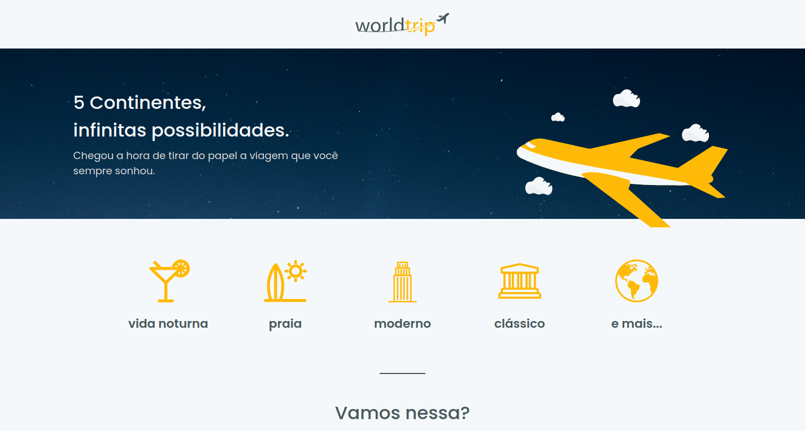

# Next-world-trip

<p align="center">
  
</p>

<h2 align="center">
  A responsive trip guide application build with Next.JS, Chakra UI, Prismic and Typescript.
</h2>

<p align="center">
  
  
  
  
  <a href="https://github.com/areasflavio/next-world-trip/commits/master">
    
  </a>
</p>

<p align="center">
  <a href="#star-features">Features</a>&nbsp;&nbsp;|&nbsp;&nbsp;
  <a href="#keyboard-technologies">Technologies</a>&nbsp;&nbsp;|&nbsp;&nbsp;
  <a href="#computer_mouse-installation">Installation</a>
</p>





<br/>

# :star: Features

This is a travel guide app. You can get information about travel and about the
continents or whichever one you choose to go to.

Some key features are:

- Functional application with Next.JS and SSG.
- UI built with ChakraUI.
- Fully responsive.
- Data is fetched from Prismic CMS.

The application is built using ReactJS with Next.JS framework and SSG feature. The
data is provided by Prismic CMS, fetched by API. The user interface is built with
the amazing ChakraUI declarative component library. The entire codebase is written
using Typescript.

> Project developed as a challenge for Chapter IV of Rocketseat's Ignite bootcamp.

<p align="center">
  You can also check out the <a href="https://next-world-trip.vercel.app">full version</a>
  of the hosted application at:
</p>
<p align="center">
    
</p>

[(Back to top)](#Next-world-trip)

<br/>

# :keyboard: Technologies

[(Back to top)](#Next-world-trip)

This is what i used and learned with this project:

- [x] ReactJS
- [x] Next.JS
- [x] Chackra UI
- [x] Prismic CMS
- [x] Swiper
- [x] Eslint
- [x] Typescript

<br/>

# :computer_mouse: Installation

[(Back to top)](#Next-world-trip)

To use this project, first you need NodeJS running in your device, then you can
follow the commands below:

```bash
# Clone this repository
git clone https://github.com/areasflavio/next-world-trip.git

# Go into the repository
cd next-world-trip

# Install dependencies for the application
yarn install

# Copy the .env.example to the .env.local file and inject your credentials
cp .env.example .env.local

# To start the development server, run the following command
yarn dev
```

# :man_technologist: Author

[(Back to top)](#Next-world-trip)

Build by Flávio Arêas 👋 [Get in touch!](https://www.linkedin.com/in/areasflavio/)
